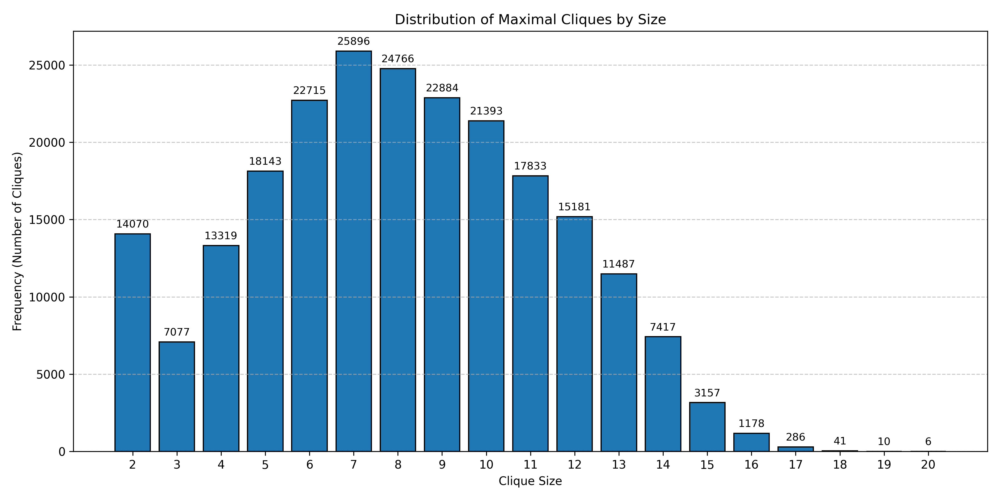

# The worst-case time complexity for generating all maximal cliques and computational experiments

Etsuji Tomita, Akira Tanaka, Haruhisa Takahashi

## Pseudocode

The following is the pseudocode of the algorithm

```py
procedure CLIQUES(G)
    /* Graph G = (V, E) */

begin
    /* global variable Q is to constitute a clique */
    Q := ∅;
    EXPAND(V, V)
end of CLIQUES

procedure EXPAND(SUBG, CAND)
begin
    if SUBG = ∅
        then print ("clique,")
        /* to represent that Q is a maximal clique */
    else 
        u := a vertex in SUBG that maximizes | CAND ∩ Γ(u) |;
        /* let EXT_u = CAND − Γ(u); */
        /* FINI := ∅; */

        while CAND − Γ(u) ≠ ∅
        do 
            q := a vertex in (CAND − Γ(u));
            print (q, ",");
            /* to represent the next statement */
            Q := Q ∪ {q};
            SUBG_q := SUBG ∩ Γ(q);
            CAND_q := CAND ∩ Γ(q);
            EXPAND(SUBG_q, CAND_q);
            CAND := CAND − {q}; /* FINI := FINI ∪ {q}; */
            print ("back,");
            /* to represent the next statement */
            Q := Q − {q}
        od
    fi
end of EXPAND
```

## Recursive Approach

The following C++ implementation is based on [Computational Techniques for Maximum Clique Problems.](https://doi.org/10.1016/j.tcs.2006.06.015)

```cpp
#include <iostream>
#include <vector>
#include <unordered_set>
#include <algorithm>
#include <fstream>
#include <sstream>
#include <chrono>
#include <unordered_map>

using namespace std;
using namespace std::chrono;

using Graph = vector<vector<int>>;

vector<int> Q;
vector<vector<int>> maximal_cliques;

vector<int> intersection(const vector<int>& a, const vector<int>& b) {
    vector<int> result;
    set_intersection(a.begin(), a.end(), b.begin(), b.end(), back_inserter(result));
    return result;
}

vector<int> difference(vector<int> a, const vector<int>& b) {
    vector<int> result;
    set_difference(a.begin(), a.end(), b.begin(), b.end(), back_inserter(result));
    return result;
}

void EXPAND(const Graph& G, vector<int>& cand, vector<int>& SUBG) {
    if (SUBG.empty()) {
        maximal_cliques.push_back(Q);
        return;
    }
    
    vector<int> fini = difference(SUBG, cand);
    int pivot = -1, max_size = -1;
    
    for (int u : SUBG) {
        vector<int> intersection_result = intersection(cand, G[u]);
        if ((int)intersection_result.size() > max_size) {
            max_size = intersection_result.size();
            pivot = u;
        }
    }
    
    vector<int> ext = difference(cand, G[pivot]);
    
    for (int q : ext) {
        Q.push_back(q);
        vector<int> cand_q = intersection(cand, G[q]);
        vector<int> subg_q = intersection(SUBG, G[q]);
        
        EXPAND(G, cand_q, subg_q);
        
        Q.pop_back();
        cand.erase(remove(cand.begin(), cand.end(), q), cand.end());
        fini.push_back(q);
    }
}

Graph createGraph(int n, const vector<pair<int, int>>& edges) {
    Graph G(n);
    for (const auto& edge : edges) {
        G[edge.first].push_back(edge.second);
        G[edge.second].push_back(edge.first);
    }
    for (auto& neighbors : G) {
        sort(neighbors.begin(), neighbors.end());
    }
    return G;
}

vector<vector<int>> CLIQUES(const Graph& G) {
    Q.clear();
    maximal_cliques.clear();
    
    vector<int> cand(G.size()), subg(G.size());
    for (int i = 0; i < G.size(); i++) {
        cand[i] = i;
        subg[i] = i;
    }
    
    EXPAND(G, cand, subg);
    return maximal_cliques;
}

void printCliquesCount(vector<vector<int>> cliques, ofstream& outfile) {
    unordered_map<int, int> size_count;

    for (const auto& clique : cliques) {
        size_count[clique.size()]++;
    }

    vector<pair<int, int>> sorted_sizes(size_count.begin(), size_count.end());
    sort(sorted_sizes.begin(), sorted_sizes.end());

    int totalcnt=0;
    for (const auto& pair : sorted_sizes) {
        outfile << "Size " << pair.first << ": " << pair.second << endl;
        totalcnt+=pair.second;
    }
    outfile<<"Total number of maximal cliques: "<<totalcnt<<endl;
}


bool readGraphFromFile(const string& filename, int& n, vector<pair<int, int>>& edges) {
    ifstream file(filename);
    if (!file.is_open()) {
        cerr << "Error: Could not open file " << filename << endl;
        return false;
    }
    
    string line;
    if (getline(file, line)) {
        istringstream iss(line);
        int m;
        if (!(iss >> n >> m)) {
            cerr << "Error: Invalid format for vertices and edges count" << endl;
            return false;
        }
    } else {
        cerr << "Error: Empty file" << endl;
        return false;
    }
    
    edges.clear();
    while (getline(file, line)) {
        istringstream iss(line);
        int u, v;
        if (iss >> u >> v) {
            if (u < 0 || u >= n || v < 0 || v >= n) {
                cerr << "Warning: Edge (" << u << ", " << v << ") contains invalid vertex index" << endl;
                continue;
            }
            edges.emplace_back(u, v);
        } else {
            cerr << "Warning: Invalid edge format in line: " << line << endl;
        }
    }
    file.close();
    return true;
}

int main() {
    int n;
    vector<pair<int, int>> edges;
    
    if (!readGraphFromFile("C:/Users/HP/Desktop/Acads/3 2/daa/assignment-1/tc1.txt", n, edges)) {
        cerr << "Failed to read graph from input.txt" << endl;
        return 1;
    }
    
    ofstream outfile("output-email.txt");
    if (!outfile.is_open()) {
        cerr << "Error: Could not open output.txt for writing" << endl;
        return 1;
    }
    
    outfile << "Read graph with " << n << " vertices and " << edges.size() << " edges" << endl;
    
    Graph G = createGraph(n, edges);
    
    auto start_time = high_resolution_clock::now();
    vector<vector<int>> cliques = CLIQUES(G);
    auto end_time = high_resolution_clock::now();
    
    printCliquesCount(cliques, outfile);
    outfile << "Execution time: " << duration_cast<milliseconds>(end_time - start_time).count() << " milliseconds" << endl;
    
    outfile.close();
    return 0;
}
```

### Usage

Save the above code as `tomita.cpp`

Run the following code in a terminal.

`sudo` permissions are required to increase the recursion stack limit.

```bash
g++ -O3 tomita.cpp
./a.out
```

Output for the code will be saved in `output.txt`.
Terminal will display any error, debugging and progress statements.

### Issues

#### Stack Overflow

Since the algorithm uses recursion, larger graphs may run into stack overflow due to deep recursion. To avoid this, we increase the stack space to 512 Mb.

We do this using the `sys/resource.h` library with the following code:

```cpp
void increase_stack_size(rlim_t stack_size = 512 * 1024 * 1024) {  // 512 MB stack
    struct rlimit rl;

    int result = getrlimit(RLIMIT_STACK, &rl);
    if (result != 0) {
        cerr << "Error getting stack limit: " << strerror(errno) << endl;
        return;
    }

    if (rl.rlim_cur < stack_size) {
        rl.rlim_cur = stack_size;
        if (rl.rlim_max < rl.rlim_cur) {
            rl.rlim_max = rl.rlim_cur;  // Also increase hard limit if necessary
        }

        result = setrlimit(RLIMIT_STACK, &rl);
        if (result != 0) {
            cerr << "Error setting stack limit: " << strerror(errno) << endl;
        } else {
            cerr << "Stack size increased to " << (stack_size / (1024 * 1024)) << " MB" << endl;
        }
    }
}

```

This ensures that we don't run out of stack space, even for larger graphs.

### Time Complexity

This algorithm incorporates pruning techniques similar to those used in the Bron–Kerbosch algorithm.
The maximal cliques produced are organized in a tree-like structure.  
The worst-case time complexity of this algorithm is _O(3<sup>n/3</sup>)_ for a graph with _n_ vertices.  
This complexity is optimal with respect to _n_, as there can be up to _O(3<sup>n/3</sup>)_ maximal cliques in an _n_-vertex graph.

## Results

### Wikipedia Vote Network Dataset

```bash
---------------------------STATS-----------------------------
Execution time: 3333 ms
Total number of maximal cliques: 460185
Number of cliques of different sizes:
Size 1: 1183 cliques
Size 2: 8655 cliques
Size 3: 13718 cliques
Size 4: 27292 cliques
Size 5: 48416 cliques
Size 6: 68872 cliques
Size 7: 83266 cliques
Size 8: 76732 cliques
Size 9: 54456 cliques
Size 10: 35470 cliques
Size 11: 21736 cliques
Size 12: 11640 cliques
Size 13: 5449 cliques
Size 14: 2329 cliques
Size 15: 740 cliques
Size 16: 208 cliques
Size 17: 23 cliques
Size of maximal cliques: 17

```



### Enron Email Network Dataset

```bash
---------------------------STATS-----------------------------
Execution time: 14465 ms
Total number of maximal cliques: 226859
Number of cliques of different sizes:
Size 2: 14070 cliques
Size 3: 7077 cliques
Size 4: 13319 cliques
Size 5: 18143 cliques
Size 6: 22715 cliques
Size 7: 25896 cliques
Size 8: 24766 cliques
Size 9: 22884 cliques
Size 10: 21393 cliques
Size 11: 17833 cliques
Size 12: 15181 cliques
Size 13: 11487 cliques
Size 14: 7417 cliques
Size 15: 3157 cliques
Size 16: 1178 cliques
Size 17: 286 cliques
Size 18: 41 cliques
Size 19: 10 cliques
Size 20: 6 cliques
Size of maximal cliques: 20

```


### As Skitter Network Dataset

```bash
---------------------------STATS-----------------------------
Execution time: 54767117 ms
Total number of maximal cliques: 37322355
Number of cliques of different sizes:
Size 2: 2319807 cliques
Size 3: 3171609 cliques
Size 4: 1823321 cliques
Size 5: 939336 cliques
Size 6: 684873 cliques
Size 7: 598284 cliques
Size 8: 588889 cliques
Size 9: 608937 cliques
Size 10: 665661 cliques
Size 11: 728098 cliques
Size 12: 798073 cliques
Size 13: 877282 cliques
Size 14: 945194 cliques
Size 15: 980831 cliques
Size 16: 939987 cliques
Size 17: 839330 cliques
Size 18: 729601 cliques
Size 19: 639413 cliques
Size 20: 600192 cliques
Size 21: 611976 cliques
Size 22: 640890 cliques
Size 23: 673924 cliques
Size 24: 706753 cliques
Size 25: 753633 cliques
Size 26: 818353 cliques
Size 27: 892719 cliques
Size 28: 955212 cliques
Size 29: 999860 cliques
Size 30: 1034106 cliques
Size 31: 1055653 cliques
Size 32: 1017560 cliques
Size 33: 946717 cliques
Size 34: 878552 cliques
Size 35: 809485 cliques
Size 36: 744634 cliques
Size 37: 663650 cliques
Size 38: 583922 cliques
Size 39: 520239 cliques
Size 40: 474301 cliques
Size 41: 420796 cliques
Size 42: 367879 cliques
Size 43: 321829 cliques
Size 44: 275995 cliques
Size 45: 222461 cliques
Size 46: 158352 cliques
Size 47: 99522 cliques
Size 48: 62437 cliques
Size 49: 39822 cliques
Size 50: 30011 cliques
Size 51: 25637 cliques
Size 52: 17707 cliques
Size 53: 9514 cliques
Size 54: 3737 cliques
Size 55: 2042 cliques
Size 56: 1080 cliques
Size 57: 546 cliques
Size 58: 449 cliques
Size 59: 447 cliques
Size 60: 405 cliques
Size 61: 283 cliques
Size 62: 242 cliques
Size 63: 146 cliques
Size 64: 84 cliques
Size 65: 49 cliques
Size 66: 22 cliques
Size 67: 4 cliques
Size of maximal cliques: 67


```


