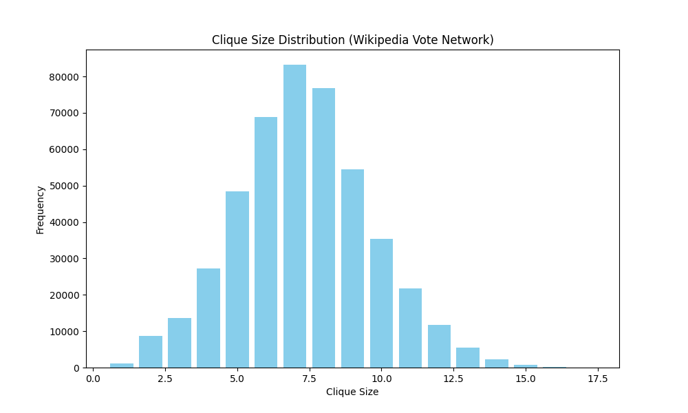
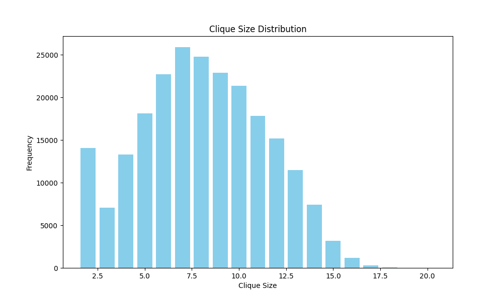

# The worst-case time complexity for generating all maximal cliques and computational experiments

Etsuji Tomita, Akira Tanaka, Haruhisa Takahashi

## Recursive Approach

The following C++ implementation is based on [Computational Techniques for Maximum Clique Problems.](https://doi.org/10.1016/j.tcs.2006.06.015)

```cpp
#include<vector>
#include<iostream>
#include<queue>
#include<set>
#include<algorithm>
#include<unordered_map>
#include <unordered_set>

#define ll long long

using namespace std;

set<int> Q;
ll n;

ll max_clique_size=INT64_MIN;
ll total_cliques=0;

time_t start, finish;
unordered_map<ll,ll> distro;

int findu(const vector<vector<int>>& adj, const vector<int>& cand) {
    int max_count = -1;
    int pivot = -1;

    unordered_set<int> cand_set(cand.begin(), cand.end());

    for (int v = 0; v < n; v++) {
        int conn_count = 0;
        for (int neighbor : adj[v]) {
            if (cand_set.count(neighbor)) {
                conn_count++;
            }
        }

        if (conn_count > max_count) {
            max_count = conn_count;
            pivot = v;
        }
    }
    return pivot;
}

vector<int> find_intersection(const vector<int>& a, const vector<int>& b) {
    vector<int> res;
    res.reserve(min(a.size(), b.size()));

    vector<int> sorted_a = a;
    vector<int> sorted_b = b;
    sort(sorted_a.begin(), sorted_a.end());
    sort(sorted_b.begin(), sorted_b.end());

    set_intersection(sorted_a.begin(), sorted_a.end(),
                     sorted_b.begin(), sorted_b.end(),
                     back_inserter(res));
    return res;
}

void expand(vector<vector<int>>& adj,vector<int> subg,vector<int> cand){
    if(subg.empty()){
        total_cliques++;
        max_clique_size=max(max_clique_size,(ll)Q.size());
        distro[Q.size()]++;
        // for (int v : Q) cout << v << " ";
        // cout<<endl;
    }else{
        int u=findu(adj,cand);
        queue<int> ext_u;
        for(auto it:cand){
            int flag=0;
            for(auto it:adj[u]){
                if(it==u){
                    flag=1;
                    break;
                }
            }
            if(flag==0){
                ext_u.push(it);
            }
        }
        while(!ext_u.empty()){
            int q=ext_u.front();
            Q.insert(q);
            vector<int> subg_q=find_intersection(subg,adj[q]);;
            vector<int> cand_q=find_intersection(cand,adj[q]);
            expand(adj,subg_q,cand_q);
            for(int i=0;i<cand.size();i++){
                if(cand[i]==q){
                    cand.erase(cand.begin()+i);
                    break;
                }
            }
            Q.erase(q);
            ext_u.pop();
        }
    }
}

void cliques(vector<vector<int>>& adj,vector<int> &v,vector<pair<int,int>> e){
    Q.clear();
    expand(adj,v,v);
}

int main(){
    int m;
    cin>>n>>m;
    vector<vector<int>> adj(n);
    vector<pair<int,int>> e;
    for(int i=0;i<m;i++){
        int a,b;
        cin>>a>>b;
        e.push_back({a,b});
    }

    for(auto it:e){
        adj[it.first].push_back(it.second);
        adj[it.second].push_back(it.first);
    }
    vector<int> v;
    for(int i=0;i<n;i++){
        v.push_back(i);
    }
    cliques(adj,v,e);

    cout<<"----------------------STATS----------------------"<<endl;
    cout<<"Total cliques: "<<total_cliques<<endl;
    cout<<"Max clique size: "<<max_clique_size<<endl;
    cout<<"Clique size distribution: "<<endl;

    for(auto it:distro){
        cout<<it.first<<": "<<it.second<<endl;
    }
    return 0;
}

```

<!-- ### Issues

-   Recursive runs well for - [SNAP: Enron Email Network Dataset](https://snap.stanford.edu/data/email-Enron.html) and [SNAP: Wikipedia Vote Network](https://snap.stanford.edu/data/wiki-Vote.html), but runs into Stack Overflow for [SNAP: AS Skitter Internet Topology Graph](https://snap.stanford.edu/data/as-Skitter.html) dataset due to deep recursion.
-   Thus, to further optimize the algorithm, we convert it into an iterative version

## Iterative Approach -->

## Results

### Wikipedia Vote Network Dataset

```bash
---------------------------STATS-----------------------------
Execution time: 43114 ms
Total number of maximal cliques: 460185
Number of cliques of different sizes:
Size 1: 1183 cliques
Size 2: 8655 cliques
Size 3: 13718 cliques
Size 4: 27292 cliques
Size 5: 48416 cliques
Size 6: 68872 cliques
Size 7: 83266 cliques
Size 8: 76732 cliques
Size 9: 54456 cliques
Size 10: 35470 cliques
Size 11: 21736 cliques
Size 12: 11640 cliques
Size 13: 5449 cliques
Size 14: 2329 cliques
Size 15: 740 cliques
Size 16: 208 cliques
Size 17: 23 cliques
Size of maximal cliques: 17

```



### Enron Email Network Dataset

```bash
---------------------------STATS-----------------------------
Execution time: 97141 ms
Total number of maximal cliques: 226859
Number of cliques of different sizes:
Size 2: 14070 cliques
Size 3: 7077 cliques
Size 4: 13319 cliques
Size 5: 18143 cliques
Size 6: 22715 cliques
Size 7: 25896 cliques
Size 8: 24766 cliques
Size 9: 22884 cliques
Size 10: 21393 cliques
Size 11: 17833 cliques
Size 12: 15181 cliques
Size 13: 11487 cliques
Size 14: 7417 cliques
Size 15: 3157 cliques
Size 16: 1178 cliques
Size 17: 286 cliques
Size 18: 41 cliques
Size 19: 10 cliques
Size 20: 6 cliques
Size of maximal cliques: 20

```


